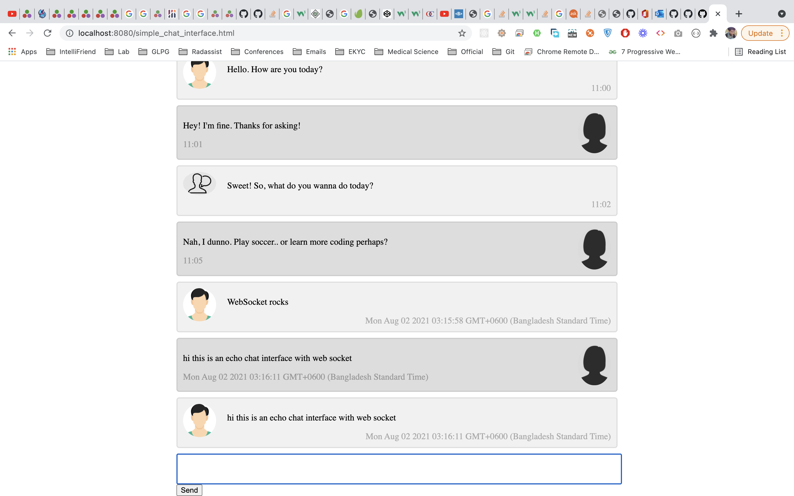

# Getting started
install julia 1.6
install packages by running `julia addManualPackages.jl`
run run.sh

# Status:

# Close it
please kill python and julia process separately. It is running in your background